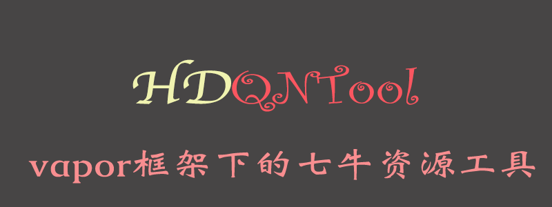

# VAPOR - HDQNTool

Qiniu upload server sdk under vapor framework，vapor框架下的七牛上传服务器sdk

`Qiniu ` is an independent third-party CDN company in China, which provides free cdn quota and quality experience. There may not be many users in other countries. If you need English instructions, you can submit an issue.

`vapor`是一个`swift`语言开发的服务器框架，该项目是在`vapor`框架下集成使用七牛存储功能，目前集成了上传文件和删除文件功能。

使用`swift`语言开发，基于`七牛`官网的`Api`接口，三行代码即可快速集成服务器端功能。

## 一、项目集成

可以采用SPM方式添加，也可以采用源文件方式添加

### vapor 3.0版本集成SPM方式集成

在`Vapor`项目的`Package`文件中，在`dependencies`添加依赖

```
.package(url: "https://github.com/DamonHu/HDQNTool-Vapor.git", from: "1.0.0")
```

在`targets`中添加

```
.target(name: "App", dependencies: ["Vapor", "HDQNTool"]),
```

### vapor 4.0版本集成SPM方式集成

在`Vapor`项目的`Package`文件中，在`dependencies`添加依赖

```
.package(url: "https://github.com/DamonHu/HDQNTool-Vapor.git", from: "4.0.0")
```

在`targets`中添加

```
.target(name: "App", dependencies: [
            .product(name: "HDQNTool", package: "HDQNTool-Vapor"),
        ]),
```


### 1.2、源文件方式添加

将本git仓库里面的`Sources`目录下的`HDQNTool`整个文件夹拖入添加到工程即可

## 二、快速使用

### 2.1、上传资源

手机客户端等通过七牛sdk上传资源时，必须要知道一个`token`和`key`，这个封装的`uploadFile`接口就是生成`token`和`key`的，并不是你用客户端把资源上传到这个接口，这个接口直接拿资源上传到服务器

```
//1、导入工具
import HDQNTool
//2、创建工具，需要把accessKey和secretKey换成你在七牛后台的accessKey和secretKey
let qnTool = HDQNTool(accessKey: "1233333", secretKey: "12333322")
//3、上传资源，把bucket换成你自己的bucket名字，fileName写想要上传的文件名
try qnTool.uploadFile(req, bucket: "bucketName", fileName: "fileName")
```

该接口返回的是`Res_QNDataConfig`类，里面包含了上传的token和file名字，然后你可以自己返回到请求中，这样客户端使用官方sdk上传资源时，就可以取到需要的`token`和`fileKey`了

### 2.2、删除资源

发起该请求，即可删除七牛对应bucket里面对应的资源

```
//1、导入工具
import HDQNTool
//2、创建工具，需要把accessKey和secretKey换成你在七牛后台的accessKey和secretKey
let qnTool = HDQNTool(accessKey: "1233333", secretKey: "12333322")
//3、上传资源，把bucket换成你自己的bucket名字，fileName写想要上传的文件名
try qnTool.deleteFile(req, bucket: "lazypigflarum", fileName: fileName)
```

该接口返回的是`UInt`类型的错误码，可以参考下面错误码对应的报错

|HTTP状态码|	含义|
|----|----|
|200		|	删除成功|
|400		|	请求报文格式错误|
|401		|	管理凭证无效|
|599		|	服务端操作失败|
|612		|	待删除资源不存在|

## 三、其他说明

目前只封装了上传和删除功能，其他操作你可以参考封装，我也会根据需求进行扩充。
